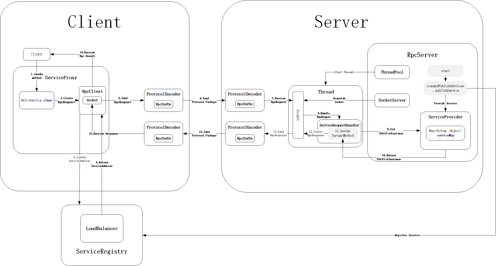

## MyRPC
本项目为RPC框架的demo，实现RPC调用的基本功能。
MyRPC基本组件及其功能为：
1. RPC entity：RPC通信的实体类(RpcRequest、RpcRequest)，包含RPC请求和调用的基本信息
2. Rpc SerDe ：RPC entity的序列化/反序列化类
3. RPC Protocol：RPC通信协议以及其编解码器(ProtocolCoDec)
4. RPC Service：
    1. 服务代理：客户端代理服务接口实现RPC远程调用
    2. 服务提供：服务端实现服务接口，并提供服务实例调用
    3. 服务处理：服务端根据RPC请求信息，调用相应服务实例方法，获取结果
    3. 服务注册中心：储存各服务端服务地址，供客户端查询
    4. 负载均衡器：将服务请求均衡到多台机器中
5. RPC Transport：提供RPC调用的通信类（Socket、Netty）
    

## MyRPC通信过程



## Server使用
### 1. 创建RpcServer对象
(1) 创建RpcServer的Builder对象
```java
NettyServer.Builder builder = new NettyServer.Builder(new InetSocketAddress("127.0.0.1",9999));//参数为服务器的IP和监听端口
```
(2) 配置Builder
```java
builder = builder.serviceProvider(new MemoryServiceProvider())//默认为MemoryServiceProvider
                .serviceRegistry(new NacosServiceRegistry(new InetSocketAddress("192.168.99.100", 8848)))//默认不使用注册中心，即为Null
                .rpcSerDe(RpcSerDe.getByCode(SerDeCode.valueOf("KRYO").getCode()))//默认为KryoSerDe
                .autoScanService(true);//默认为true    
```
(3) 构建RpcServer
```java
RpcServer server = builder.build();
```

### 2. 服务发布
#### 2.1 自动扫描和发布服务(默认情况)
(1) 在启动类上标注注解@ServiceScan
```java
@ServiceScan
public class TestNettyServer
```
(2) 在服务实现类上标注注解@Service
```java
@Service
public class HelloServiceImpl implements HelloService
```
#### 2.2 手动发布服务
(1) 创建服务接口实现类实例对象
```java
HelloService helloService = new HelloServiceImpl();
```
(2) 使用RpcServer的publishService方法注册服务
```java
server.publishService(helloService, HelloService.class.getCanonicalName());//服务名称必须使用全类名，否则客户端无法识别
```
### 3. 启动RpcServer
```java
server.start();
```


## client使用

### 1. 创建RpcClient
#### 1.1 使用RpcServer的ip地址和端口创建
```java
 RpcClient rpcClient = new NettyClient("127.0.0.1",9999);
```
#### 1.2 使用注册中心创建
```java
ServiceRegistry serviceRegistry = new NacosServiceRegistry(new InetSocketAddress("192.168.99.100", 8848));
RpcClient rpcClient = new NettyClient(serviceRegistry);
```

#### 2. 创建服务代理对象
```java
ServiceProxy serviceProxy = new ServiceProxy(rpcClient);
HelloService helloService = serviceProxy.getProxy(HelloService.class);
```

#### 3. Rpc调用
```java
String res = helloService.hello(new HelloObject(12, "This is a message"));
System.out.println(res);
```


参考：
https://blog.csdn.net/qq_40856284/article/details/106972591
https://blog.guoziyang.top/archives/60/
https://github.com/CN-GuoZiyang/My-RPC-Framework
https://github.com/Snailclimb/guide-rpc-framework