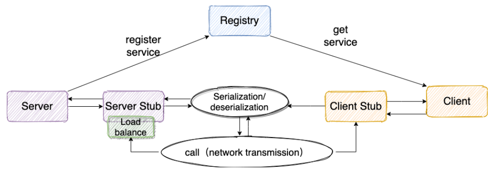
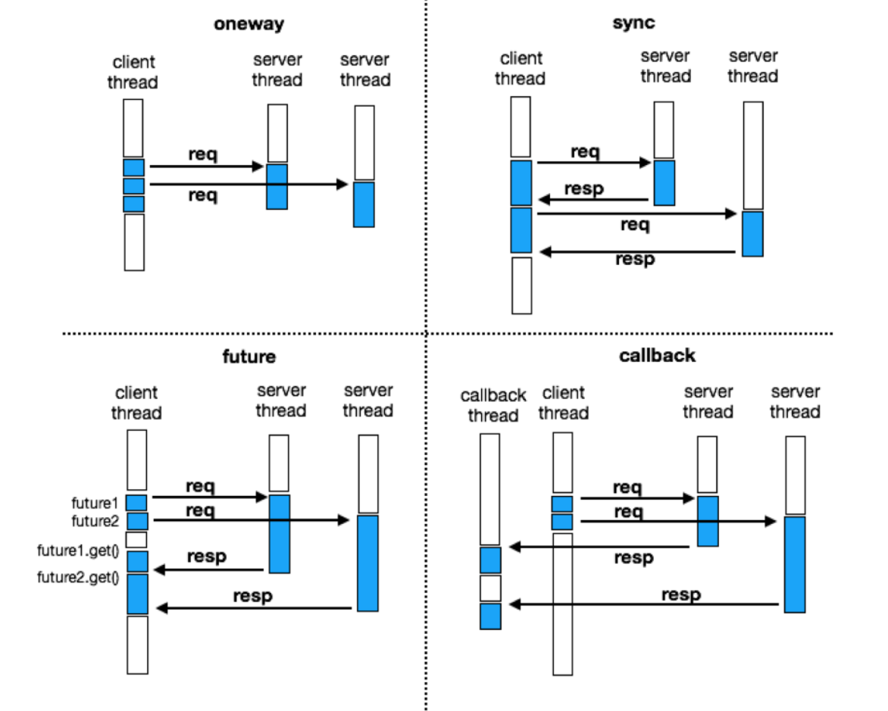

## MyRPC
本项目为RPC框架的demo，实现RPC调用的基本功能。
本项目实现的功能：
1. 基于Netty的网络通信, 实现ChannelPool复用连接
2. 服务注册中心（目前以实现Nacos和Zookeeper）以及服务选择负载均衡
3. Rpc通信协议以及对应的编解码器
4. 序列化反序列化器（目前已实现JSON和Kryo）
5. 基于注解的服务自动扫描与发布
6. 四种Rpc调用方式（OneWay、Sync、Future、Callback）
7. 异步的Rpc调用超时处理
8. 可扩展以及可动态配置的组件，包括注册中心，负载均衡器、通信协议、序列化器

需要继续改进的功能：
1. ChannelPool中连接的心跳检测的维护以及长时间不使用的连接的销毁
2. 通信数据的压缩
...
    
## Rpc通信的基本原理


1. 调用者（客户端Client）以本地调用的方式发起调用；
2. Client stub（客户端存根）收到调用后，将被调用的服务接口名发送到服务注册中心，获取指定服务的服务端地址。
3. Client stub（客户端存根）收到服务端地址后，负责将被调用的方法名、参数等打包编码成特定格式的能进行网络传输的消息体；
4. Client stub将消息体通过网络发送给服务端；
5. Server stub（服务端存根）收到通过网络接收到消息后按照相应格式进行拆包解码，获取方法名和参数；
6. Server stub根据方法名和参数进行本地调用；
7. 被调用者（Server）本地调用执行后将结果返回给server stub；
8. Server stub将返回值打包编码成消息，并通过网络发送给客户端；
9. Client stub收到消息后，进行拆包解码，返回给Client；
10. Client得到本次RPC调用的最终结果。


## MyRPC组件通信过程


## Server使用
### 1. 创建RpcServer对象
(1) 创建RpcServer的Builder对象
```java
NettyServer.Builder builder = new NettyServer.Builder(new InetSocketAddress("127.0.0.1",9999));//参数为服务器的IP和监听端口
```
(2) 配置Builder
```java
builder = builder.serviceRegistry(new NacosServiceRegistry(new InetSocketAddress("192.168.99.100", 8848)))//默认不使用注册中心，即为Null
                .autoScanService(true);//默认为true    
```
(3) 构建RpcServer
```java
RpcServer server = builder.build();
```

### 2. 服务发布
#### 2.1 自动扫描和发布服务(默认情况)
(1) 在启动类上标注注解@ServiceScan
```java
@ServiceScan
public class TestNettyServer
```
(2) 在服务实现类上标注注解@Service
```java
@Service
public class HelloServiceImpl implements HelloService
```
#### 2.2 手动发布服务
(1) 创建服务接口实现类实例对象
```java
HelloService helloService = new HelloServiceImpl();
```
(2) 使用RpcServer的publishService方法注册服务
```java
server.publishService(helloService, HelloService.class.getCanonicalName());//服务名称必须使用全类名，否则客户端无法识别
```
### 3. 启动RpcServer
```java
server.start();
```


## client使用

### Rpc调用的四种方式



### 1. 创建ProxyConfig

```java
ProxyConfig proxyConfig = new ProxyConfig()
                .setDirectServerUrl("127.0.0.1:9999")
                //.setRegistryCenterUrl("nacos://192.168.99.100:8848")//RegistryCenterUrl和DirectServerUrl不可同时设置
                .setInvokeType(InvokeType.CALLBACK)//OneWay、Sync、Future、Callback四种方式
                .setTimeout(5000);//Rpc调用的timeout,单位为毫秒
```

### 2. 创建服务代理对象
```java
HelloService helloService = proxyConfig.getProxy(HelloService.class);
```

### 3. Rpc调用

#### 3.1 oneway方式
```java
proxyConfig.setInvokeType(InvokeType.ONEWAY);
ByeService byeService = proxyConfig.getProxy(ByeService.class);
byeService.bye("bye");
```

#### 3.2 sync方式
```java
proxyConfig.setInvokeType(InvokeType.SYNC);
HelloService helloService = proxyConfig.getProxy(HelloService.class);
String res = helloService.hello(new HelloObject(1,"hello1"));
System.out.println("sync : " + res);
```

#### 3.3 future方式
```java
proxyConfig.setInvokeType(InvokeType.FUTURE);
HelloService helloService = proxyConfig.getProxy(HelloService.class);
String res = helloService.hello(new HelloObject(2,"hello2"));
System.out.println("it's null : " + res);
//Future必须在Rpc调用之后获取（可多次获取），且获取的Future是最近一次Rpc调用的Future。
Future future = RpcInvokeContext.getContext().getFuture();
System.out.println("future : " + future.get());
```

#### 3.4 callback方式

```java
proxyConfig.setInvokeType(InvokeType.CALLBACK);
HelloService helloService = proxyConfig.getProxy(HelloService.class);
//必须在Rpc调用之前设置Callback，每次Rpc调用以最后设置的Callback为准，Callback只会被使用一次。
RpcInvokeContext.getContext().setResponseCallback(new RpcResponseCallBack() {
    @Override
     public void onResponse(Object data) {
     System.out.println("callback : " + data);
    }
    @Override
     public void onException(Throwable throwable) { }
});
String res = helloService.hello(new HelloObject(3,"hello3"));
System.out.println("it's null : " + res);
```
#### 4. 关闭Rpc客户端
```java
//注意：关闭Rpc客户端后，还未完成的异步Rpc调用将无法完成，全部超时
ChannelPool.close();
ThreadPoolFactory.close();
```

参考：
https://blog.csdn.net/qq_40856284/article/details/106972591
https://blog.guoziyang.top/archives/60/
https://github.com/CN-GuoZiyang/My-RPC-Framework
https://github.com/Snailclimb/guide-rpc-framework
https://www.sofastack.tech/blog/sofa-rpc-synchronous-asynchronous-implementation/
https://juejin.im/post/6844903761794564104